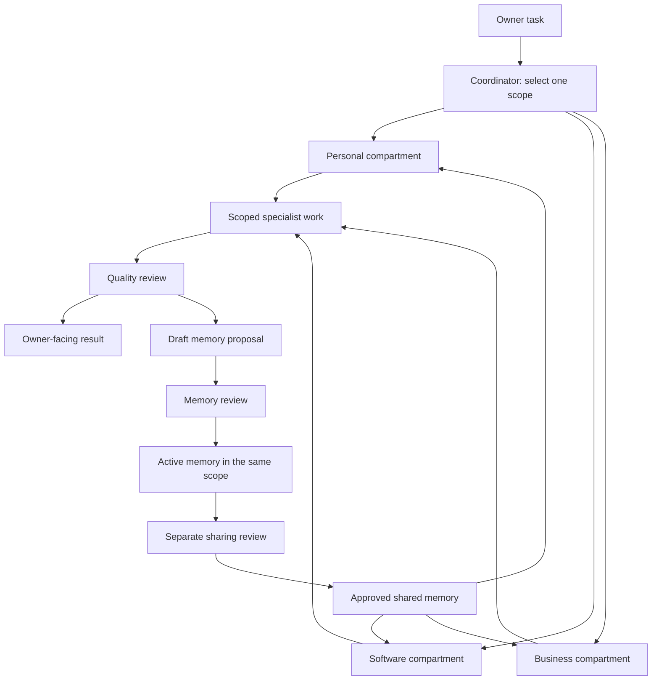

# Architecture: separate responsibilities, connected evidence

## Design principles

1. **Files are the source of truth.** A model response becomes memory only when stored and reviewed.
2. **One task, one primary scope.** Read only the necessary domain plus explicitly shared material.
3. **Small roles, clear outputs.** Each role has a purpose, input contract, output contract, and stopping condition.
4. **Evidence travels with claims.** A summary never erases where it came from.
5. **Review is separate from generation.** A second pass can challenge a draft; consequential decisions stay with the owner.
6. **The system degrades gracefully.** Human-readable files remain useful if the model or tooling disappears.

## Five layers

| Layer | Responsibility | Concrete files |
|---|---|---|
| Governance | Scope, privacy, permissions, evidence requirements | `policies/`, `config/session-contract.md` |
| Roles | What each agent is responsible for | `agents/core/`, domain `agents/` |
| Work | Current goals, tasks, sources, drafts, review | Domain `projects/`, `sessions/`, `sources/` |
| Memory | Durable, reviewed knowledge | Domain and shared `memory/records/` |
| Retrieval | Select relevant, permitted memory for a task | `tools/memory.py`, generated packets in `work/` |

The arrows describe workflow, not implemented background processes. No network service or agent scheduler is included.

## Compartments

Each domain has its own agents, memory, source collection, projects, sessions, decisions, inbox, and archive. A private task stays in its original domain. The shared folder holds low-sensitivity operating conventions and deliberately reviewed summaries. It is not a dumping ground or an automatic mirror.

Inside a domain, use project folders for organization. The included CLI filters at domain level, not project or client level. If two clients require independent access controls, put them in separate copies of the repository under separate OS permissions. A `client-a` tag is not a security boundary.

## Coordination model

The Coordinator creates a task contract and selects the fewest necessary roles. Specialists produce artifacts. The Reviewer evaluates them against the original contract. The Steward converts selected findings into draft memory. The owner or delegated operator activates it. The Archivist manages retention and restoration evidence.

One local model may simulate these roles sequentially. Multiple local models may be used when already available, but the file contracts remain the same. More agents do not automatically improve accuracy: use additional reviewers when the cost of an error justifies them.

## Growth without fragmentation

Create a new agent only when its inputs, permitted actions, deliverable, or success criteria differ materially from an existing role. Create a new domain only when its access boundary differs. Create a new project for a distinct outcome. Create a new memory only for a reusable claim, decision, procedure, preference, entity, episode, or lesson.
